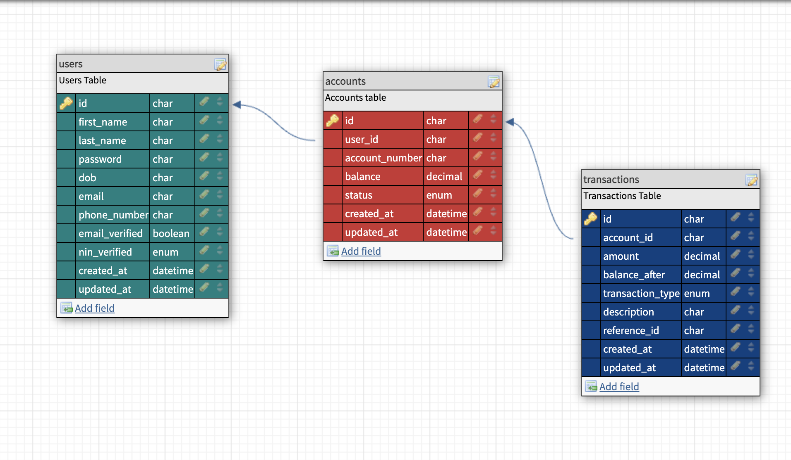

# Credit Demo

This project is a backend API for managing user accounts and transactions for a lending platform. It includes features such as account creation, funding, withdrawal, funds transfer to another user’s account, and transaction history. The project is built using Node.js, TypeScript, MySQL, and Knex.js for database management.

## Setup Instructions

### Prerequisites

-   Node.js
-   MySQL
-   Knex.js

### Installation

1. Clone the repository:
    ```bash
    git clone https://github.com/acedeywin/demo-credit-api.git
    ```

### Install dependencies

npm install

### Environment Variables

Create a .env file with the following variables:

```plaintext
DB_HOST=your-database-host
DB_USER=your-database-user
DB_PASSWORD=your-database-password
DB_NAME=your-database-name
DB_PORT=your-database-port
PORT=your-server-port
ADJUTOR_API_KEY=your-adjutor-api-key
ADJUTOR_URL=https://adjutor.lendsqr.com/v2/verification
REDIS_URL=your-redis-caching-url
USER_EMAIL=your-email-address (gmail preferable)
EMAIL_PASSWORD=your-email-app-password (see this youtube tutorial to set it setup: https://www.youtube.com/watch?v=cqdAS49RthQ&t=97s)
EMAIL_HOST=your-emai-host (e.g: smtp.gmail.com)
EMAIL_PORT=your-email-port
EMAIL_SECURE=false
EMAIL_SENDER=your-sender-title
EMAIL_SERVICE=your-email-service (e.g: gmail)
JWT_SECRET=your-jwt-secret
JWT_EXPIRY=your-jwt-expiry-interval (e.g: 1h)
```

### Running the Project

npm run compile
npm run start

## Folder Structure

```plaintext
├── src
│ ├── config # Configuration files (e.g., database config)
│ ├── controllers # API controllers to handle HTTP requests
│ ├── models # Database models (e.g., Account, User)
│ ├── services # Business logic for accounts, transactions, etc.
│ ├── routes # Route definitions for the API endpoints
│ ├── middleware # Middleware functions (e.g., authentication, validation)
│ ├── utils # Helper functions (e.g., validation, error handling)
│ ├── types # Custom TypeScript types and interfaces
│ ├── tests # Unit and integration tests
│ ├── app.ts # App entry point (express instance setup)
│ └── index.ts # Main server file (starts the server)
├── .env # Environment variables (keep sensitive data here)
├── .gitignore # Specifies files ignored by Git
├── package.json # Node dependencies and scripts
├── tsconfig.json # TypeScript configuration file
└── README.md # Documentation for the project

```

## Architecture and Design

## Architecture and Design

The project follows a modular MVC structure. The main components are:

-   **Controllers**: Handle HTTP requests and responses (located in `src/controllers`).
-   **Services**: Business logic is encapsulated in services for reusability and separation of concerns (located in `src/services`).
-   **Models**: Database models are managed with Knex for query building and MySQL integration (located in `src/models`).
-   **Routes**: All API routes are defined and mapped to the controllers (located in `src/routes`).

## Features and Functionality

### 1. Account Creation

-   Allows users to create an account.
-   Verify user's NIN before creation of an account
-   Checks the user's blacklist status using the Karma API before account creation.
-   Generates a unique account number and initializes the account with a zero balance.
-   Sends verification email to user's email address to verify user's authenticity

### 2. Account Funding

-   Enables users to deposit funds into their account.
-   Enables users to withdraw funds from their account.
-   Enables users to transfer to another user’s account.
-   Updates the account balance and logs each transaction in the transaction history.

### 3. Transaction History

-   Retrieve the transaction history for an account.
-   Each transaction includes details such as amount, type (credit or debit), and balance after the transaction.

# API Documentation

## User

### Creation User

-   **Method**: POST
-   **Endpoint**: `/api/v1/user/register`
-   **Request Body**:
    ```json
    {
        "first_name": "Tom",
        "last_name": "Dede",
        "email": "user@gmail.com",
        "password": "Awe@#254redtgf5",
        "confirm_password": "Awe@#254redtgf5",
        "phone_number": "08543409211",
        "dob": "12-09-1997",
        "nin": "36900362314"
    }
    ```
-   **Response**:

```json
{
    "status": "success",
    "message": "Account successfully created. Verification code sent to user@gmail.com"
}
```

### Verify User

-   **Method**: PUT
-   **Endpoint**: `/api/v1/user/verify-user`
-   **Request Body**:
    ```json
    {
        "email": "user@gmail.com",
        "code": "109722"
    }
    ```
-   **Response**:

```json
{
    "status": "success",
    "message": "Account successfully verified. Proceed to login."
}
```

### Get User

-   **Method**: GET
-   **Endpoint**: `/api/v1/user?user_id=209cf65bxxxx`
-   **Authorization**: Bearer `<token>`

    ```

    ```

-   **Response**:

```json
{
    "status": "success",
    "message": "'User account fetched successfully."
}
```

## Authentication

### Login

-   **Method**: POST
-   **Endpoint**: `/api/v1/auth/login`
-   **Request Body**:
    ```json
    {
        "email": "user@gmail.com",
        "password": "Awe@#254redtgf5"
    }
    ```
-   **Response**:

```json
{
    "status": "success",
    "message": "Logged in successfully",
    "token": "eyJhbGciOiJIUzI1NiIsInR5cCxxxxxxxxxxxxx4iHxTbQPC01I",
    "data": {
        "user": {
            "id": "209cf65b-df32-42c6-b8e4-e80f02886753",
            "first_name": "Tom",
            "last_name": "Dede",
            "dob": "12-09-1997",
            "email": "user@gmail.com",
            "phone_number": "08543409211",
            "email_verified": 1,
            "nin_verified": "verified",
            "created_at": "2024-11-02T21:14:58.000Z",
            "updated_at": "2024-11-02T21:14:58.000Z"
        }
    }
}
```

### Logout

-   **Method**: POST
-   **Endpoint**: `/api/v1/auth/logout`
-   **Response**:

```json
{
    "status": "success",
    "message": "'Logged out successfully."
}
```

### Reset Password

-   **Method**: POST
-   **Endpoint**: `/api/v1/auth/reset-password`
-   **Request Body**:
    ```json
    {
        "email": "user@gmail.com"
    }
    ```
-   **Response**:

```json
{
    "status": "success",
    "message": "A password reset code will been sent to user@gmail.com if it exist."
}
```

### Change Password

-   **Method**: PUT
-   **Endpoint**: `/api/v1/auth/change-password`
-   **Request Body**:
    ```json
    {
        "email": "user@gmail.com",
        "password": "De#$r560fkdewWQ",
        "confirm_password": "De#$r560fkdewWQ",
        "code": "519735"
    }
    ```
-   **Response**:

```json
{
    "status": "success",
    "message": "Password reset was successful."
}
```

## Account

### Create New Account

-   **Method**: POST
-   **Endpoint**: `/api/v1/account/create-new-account?user_id=209cf65bxxx`
-   **Authorization**: Bearer `<token>`

    ```

    ```

-   **Response**:

```json
{
    "status": "success",
    "message": "User account created successfully",
    "data": { "account_number": "2780799928" }
}
```

## Transaction

### Fund Account

-   **Method**: POST
-   **Endpoint**: `/api/v1/transaction/fund-account?user_id=209cf65bxxxx`
-   **Authorization**: Bearer `<token>`
-   **Request Body**:
    ```json
    {
        "amount": "45000",
        "account_number": "2780799928",
        "description": "Loan funding" //optional
    }
    ```
-   **Response**:

```json
{
    "status": "success",
    "message": "Account funding successful."
}
```

### Withdraw Fund

-   **Method**: POST
-   **Endpoint**: `/api/v1/transaction/withdraw-fund?user_id=209cf65bxxxx`
-   **Authorization**: Bearer `<token>`
-   **Request Body**:
    ```json
    {
        "amount": "45000",
        "account_number": "2780799928",
        "description": "Loan funding" //optional
    }
    ```
-   **Response**:

```json
{
    "status": "success",
    "message": "Fund withdrawal successful."
}
```

### Transfer Fund

-   **Method**: POST
-   **Endpoint**: `/api/v1/transaction/transfer-fund?user_id=209cf65bxxxx`
-   **Authorization**: Bearer `<token>`
-   **Request Body**:
    ```json
    {
        "amount": "45000",
        "sender_account": "2780799928",
        "receiver_account": "7704292343",
        "description": "Loan funding" //optional
    }
    ```
-   **Response**:

```json
{
    "status": "success",
    "message": "Fund transfer successful."
}
```

### Transaction History

-   **Method**: GET
-   **Endpoint**: `/api/v1/transaction/history?user_id=209cf65bxxxx&account_number=2780799928`
-   **Authorization**: Bearer `<token>`

-   **Response**:

```json
{
    "status": "success",
    "message": "'Transactions fetched successfully.",
    "data": {
        "account": {
            "id": "3d7cxxxx-9xxxxxx",
            "user_id": "209cxxxx-df32-xxxxx",
            "account_number": "2780799928",
            "balance": "11000.00",
            "status": "active",
            "created_at": "2024-11-04T08:03:13.000Z",
            "updated_at": "2024-11-04T08:03:13.000Z"
        },
        "transactions": [
            {
                "id": "5e02251c-xxxxx9",
                "account_id": "3d7ca163-xxxxx",
                "amount": "45000.00",
                "balance_after": "45000.00",
                "transaction_type": "credit",
                "description": "Loan funding",
                "reference_id": "SOC-6699410844",
                "created_at": "2024-11-04T08:04:08.000Z",
                "updated_at": "2024-11-04T08:04:08.000Z"
            },
            {
                "id": "7ed22f13-9a83-xxxx",
                "account_id": "3d7ca163-9xxxx",
                "amount": "17000.00",
                "balance_after": "28000.00",
                "transaction_type": "debit",
                "description": "Loan funding",
                "reference_id": "SOD-2036499709",
                "created_at": "2024-11-04T08:05:03.000Z",
                "updated_at": "2024-11-04T08:05:03.000Z"
            }
        ]
    }
}
```

## Design Decisions

-   **Database Schema**: Separate tables for users, accounts, and transactions for better data organization and scalability.
-   **Knex for Query Building**: Chose Knex for its flexibility and compatibility with MySQL.
-   **Modular Service Layer**: Services were created to handle business logic separately from controllers, enhancing testability and readability.

## Entity-Relationship Diagram

The following E-R diagram illustrates the database structure for this project, showing relationships between the `Users`, `Accounts`, and `Transactions` tables.



The database design includes the following entities:

-   **Users**: Stores user profile information.
-   **Accounts**: Linked to each user, holding account-specific information like account_number and balance.
-   **Transactions**: Logs each transaction for an account, including the type (credit or debit) and resulting balance.

## Testing

Unit tests were written for core services, middlewares, controllers, and utils functions. Jest was used as the test framework.

To run tests:

```bash
npm run test
```

## Known Issues and Future Enhancements

-   **NIN Verification**: Currently, users' NINs are not saved in the database after verification. So, the only way to ensure a user doesn't have a double profile account is to check against phone numbers in the database, which are mapped to each NIN. A better way would be to save users' NINs and use that to screen account creations.
-   **Improved Error Handling**: More detailed error responses could be implemented for finer-grained error handling.
